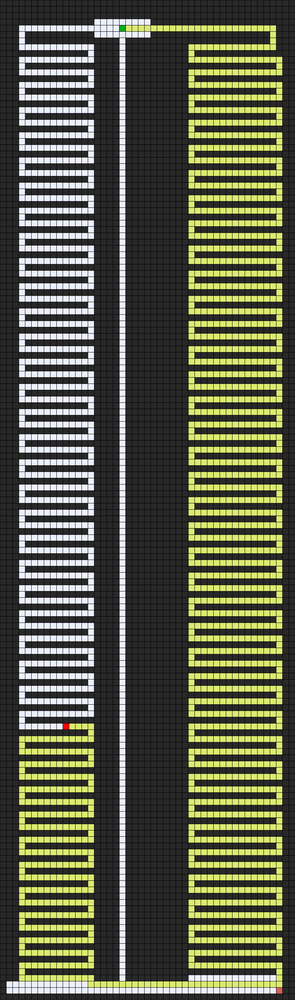
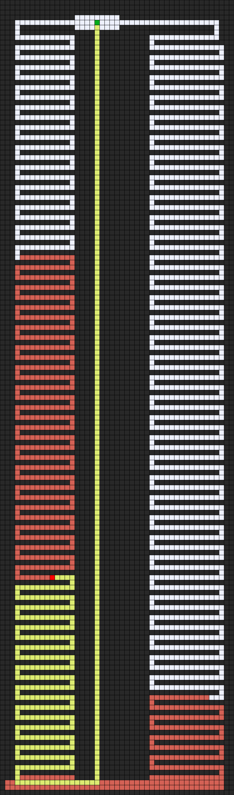
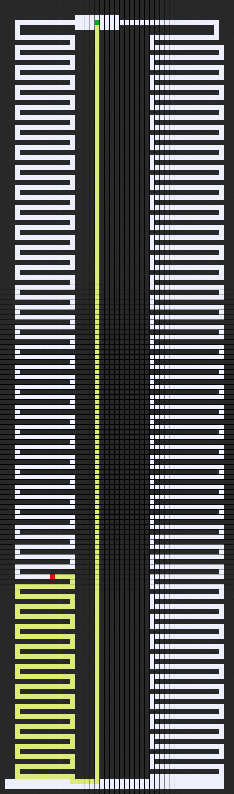

# Maze Solver
This project is a maze solver implemented in Python. It supports three different algorithms: 
- **Depth-First search (DFS)**
- **Breadth-First search (BFS)**
- **A* **

## Usage

 To use the maze solver, simply create a new Maze object and pass the filename of the maze file to the constructor. The maze file should be in a simple text format, with each line representing a row of the maze. The walls of the maze are represented by the # character, and the start and goal states are represented by the S and E characters, respectively.

Once you have created a Maze object, you can call the solve() method to solve the maze. This method will return a list of actions that can be taken to traverse the maze from the start state to the goal state.

You can also use the output_image() method to generate an image of the maze, with the solution path highlighted. 

## Example
The following code shows how to use the maze solver to solve a simple maze: 

'''
from maze import Maze

maze = Maze("maze.txt")

# Solve the maze
actions, cells = maze.solve()

# Print the solution path
for action in actions:
    print(action)

# Output an image of the maze with the solution path highlighted
maze.output_image("maze_solution.png")
'''
### DFS, BFS, and A*

The maze solver supports three different algorithms for solving mazes: depth-first search (DFS), breadth-first search (BFS), and A*.

- **DFS** is a recursive algorithm that explores the maze by following a single path until it reaches a dead end. If it reaches a dead end, it backtracks and tries another path.

- **BFS** is a non-recursive algorithm that explores the maze by expanding a queue of nodes. The queue initially contains only the start state. At each step, the algorithm removes the first node from the queue and adds its neighbors to the queue. This process continues until the goal state is reached.

- **A* ** is a heuristic algorithm that combines DFS and BFS to find the shortest path to the goal state. It uses a heuristic function to estimate the distance to the goal state from each node. This heuristic function allows A* to focus its search on the most promising nodes.

Results
Here are the results of running the maze solver on a simple maze using the DFS, BFS, and A* algorithms:

